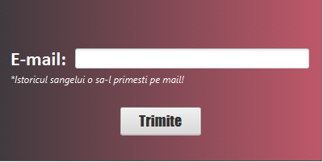

# GestiuneaDonatiilorDeSange
Prezentarea cerintei
Romania este printre ultimele locuri la donarea de sange in Uniunea Europeana, conform ultimelor studii efectuate in domeniu. Din aceasta cauza, multe vieti importante nu sunt salvate din lipsa sangelui in spitale.
Aplicatia dezvoltata de noi, aduce in prim-plan un sistem de donare complex prin legarea dnator-asistenta-laborator-baza de date-medic-pacient, pentru a facilita procesul de donare.

FUNCTIONALITATILE
Donator:
•	Poate sa devina un donator nou prin completarea unui formular cu date persoanle si o data si o ora la care vrea sa doneze. Si primeste pe mail cea mai aproiata data si ora de ceea pe care o vrea.
•	Daca vrea sa doneze iar, acesta fiind un donator vechi, poate face o programare dupa nume, prenume, mail si data+ora la care vrea si poate dona. Va primii ziua si data cele mai apropiate de cele pe care le-am transmis, pe mail.
•	Poate sa isi verifice istoricul donariilor lui prin nume, prenume si mail. Va primii un pdf pe mail despre informatiile sangelui lui, datile cand a donat, data cand poate dona iar.
•	Completeaza un chestionar inainte sa doneze sange.

Asistenta:
•	Asistenta selecteaza din combo box-ul de pe interfata log-in asistenta si baga parola unica pe care o de la administrator si se logheaza in aplicatie.
•	Cand se logheaza, in main, ii apare persoanele care sunt in ziua respectiva pentru donare sau poate alege o zi in care poate vedea donatorii.
•	Poate sa aleaga dintr-un list view un donator. Daca da click pe un donator, ii apare informatii legate de sange si instoricul donatiilor. Daca da dublu-click pe donator, ii apar informatii personale despre donator.
•	Poate sa specifice daca donatorul a donat pentru o anumita persoana.
•	Vede cand donatorul a completat chestionarul.
•	Poate sa converteasca datele donatorului si chestionarul intr-un pdf.

Laborant:
•	Laborantul selecteaza din combo box-ul log-in-ului laborant si se conecteaza cu o parola unica la main-ul laborantului.
•	Dupa ce se logheaza, ii apare in main o lista cu donatorii pe care trebuie sa-i verifice.
•	Are un buton de filtrare pentru a vedea sangele donatorilor care au donat astazi si un buton de filtrare unde poate vedea sangele donatoriilor pe care nu i-a verificat in ultimele 7 zile.
•	Are un text fild unde poate adauga grupa de sange a donatorului.
•	Are o lista cu observatiile despre sange si un text fild unde poate adauga observatii.
•	Poate sterge o observatie gresita dand dublu-click pe o observatie sau click sa modifice observatia.
•	Are un buton de trimite a datelor inapoi la secretara.

Medic:
•	Medicul selecteaza din combo box-ul log-in-ului laborant si se conecteaza cu o parola unica la main-ul medicului.
•	Are o lista unde ii apar toate centrele care au sange.
•	Poate sa selecteze grupa de sange, tipul de sange pe care-l vrea, cantitatea si poate seta o prioritate a sangelui. Dupa ce a selectat astea in lista ii apare de sus in jos cele mai apropiate centre de prelevare.

  
